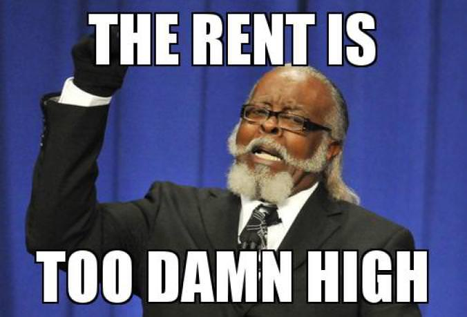
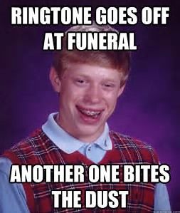

# Meme-Generator-rnn
Repository with all code related to the OCR meme generator neural network

Step 1)
Working on OCR to recognize lettering in memes 

Step 2) Set up nn

Step 3) Feed several memes to nn 

---------------------------------------------------------------------

#PROGRESS IN OCR

~~~~~~~~~~~~~~~~~~~~~~~~~~~~~~~~~~~~~~~~~~~~~~~~~~~~~~~~~~~~~~~~~~~~~

A good guide to learning how to train tesseract with new font:
https://michaeljaylissner.com/posts/2012/02/11/adding-new-fonts-to-tesseract-3-ocr-engine/#create-training-documents


Tesseract needs to be trained on the standard training data provided by tesseract for better accuracy in OCR. (Long, arduous process)

~~~~~~~~~~~~~~~~~~~~~~~~~~~~~~~~~~~~~~~~~~~~~~~~~~~~~~~~~~~~~~~~~~~~~

#Folders in repo:

The "Standard training text" folder contains all relevant tiff files needed to box train tesseract one page at a time. 

"meme-test" contains all meme training data from Abet.tiff in the "Letters png" folder.

A suggestion to start would be to remove all diacritics (symbols) from the standard training text to aid with ease of training. 

---------------------------------------------------------------------

/usr/local/share/tessdata must contain <lang>.traineddata.
The trained data used in this case is meme.traineddata (incomplete training data from the standard training data provided by tesseract for Impact outline).

# SET-UP FOR TESTING
Tested so far using two outdated memes with varying levels of white. 




Open up terminal:

```
$ export TESSDATA_PREFIX=/usr/local/share/tessdata/
```
Check to make sure the TESSDATA_PREFIX is set correctly
```
$ echo $TESSDATA_PREFIX
```

Attempted image pre-processing has yielded some results. 
From tests, sharpening of a higher quality processed image causes OCR to detect diacritics where there are none (this will be addressed later in the readme).
Lower quality images require higher thresholds and wavelet-denoise values. 

#For Meme1:
After setting up TESSDATA_PREFIX, we take our source image test1.jpg and grayscale it, turn off alpha channels and resize it 400%. We set the units to PixelsPerInch and density to 300 to prevent tesseract from complaining about resolution.

```
$ convert test1.jpg -type Grayscale -alpha Off -resize 400% -units PixelsPerInch -density 300 test1gray.jpg
$ convert test1gray.jpg -threshold 50% -alpha Off -units PixelsPerInch -density 300 -wavelet-denoise 60% test1meme.jpg
$ tesseract test1meme.jpg stdout -l meme -c tessedit_char_whitelist=ABCDEFGHIJKLMNOPQRSTUVWXYZ 
$ tesseract test1meme.jpg output1.txt -l meme -c tessedit_char_whitelist=ABCDEFGHIJKLMNOPQRSTUVWXYZ
```
 contains the result of the OCR on test1.jpg. 

#For Meme2:
A similar process may be followed for test2.jpg which is a lower quality image and has a few different terminal commands to be OCR-readable.

We raise the image threshold to 60% and teh wavelet-denoise threshold to 70% while simultaneously shapening the image.

```
$ convert test2.jpg -type Grayscale -alpha Off -resize 400% -units PixelsPerInch -density 300 test2gray.jpg
$ convert test2gray.jpg -threshold 60% -alpha Off -units PixelsPerInch -density 300 -wavelet-denoise 70% -sharpen 6 test2meme.jpg
$ tesseract test2meme.jpg stdout -l meme -c tessedit_char_whitelist=ABCDEFGHIJKLMNOPQRSTUVWXYZ
$ tesseract test2meme.jpg output2.txt -l meme -c tessedit_char_whitelist=ABCDEFGHIJKLMNOPQRSTUVWXYZ
```
 contains the result of the OCR on test2.jpg.


